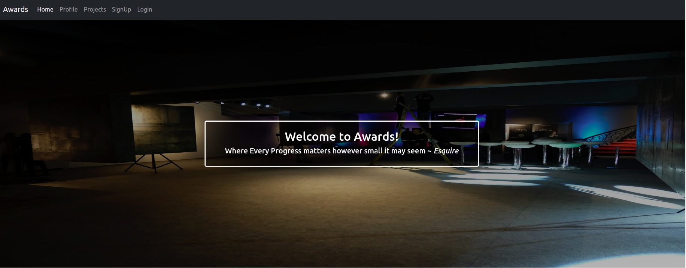
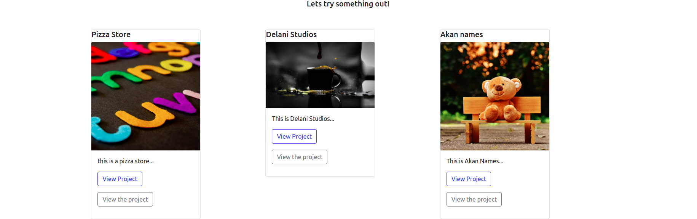
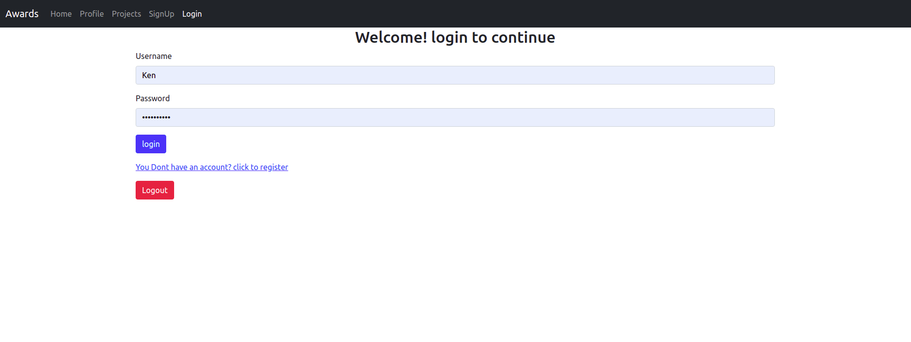
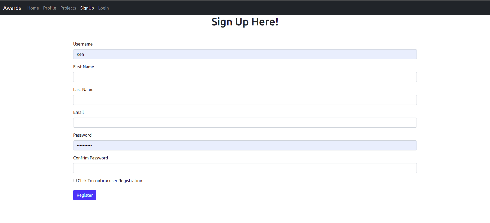
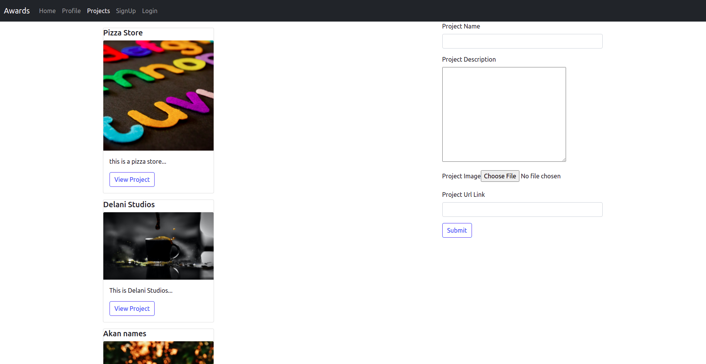
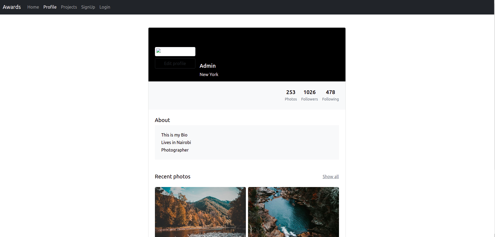

# Project_Awards

#### Created By Grievin Otieno on 24-10-2021

## Description

Projec Awards is an application that alows users to signup and login then post a project that will be reviewed and rated by other users of the application 


## Setup Requirements

* Git
* Github
* PostgreSQL
* Django
* Python 3.8
* Pip
* Web-browser or your choice
- Angular 12


## Setup Installation

- Copy the github repository url
- Clone to your computer (git clone )
- Open your terminal then navigate to the directory of the project you just cloned to your computer
- Run the following commands to start the server using virtual environment that you have created

Note:
- At this point 
you will get the backend for the project awards,

```
python3.8 -m venv virtual
```

- To activate the virtual environment

```
source virtual/bin/activate
```

```
curl https://bootstrap.pypa.io/get-pip.py | python
```

```
pip install -r requirements.txt
```

- To copy .env.example to .env

```
cp .env.example .env
```

- Edit the .env file and replace the values with your own Cloudinary credentials and database credentials

- To run the server

```
python manage.py runserver

```

- Open the browser and navigate to http://127.0.0.1:8000/ to see the application in action

- To Get Project Awards Frontend that you will use to consume the backend with, you will run this commands.

- Clone this repo;

```
 https://github.com/Grievi/Project_Awards.git
```

- run these commands

```
npm install
```

- run the server at localhost:4200

```
ng serve --open
```
## Technologies Used

The following languages have been used on this project:

* Python 
* Django
* PostgreSQL
* Bootstrap
* HTML
* Typescript


## Setup/Installation Requirements

- Live link to view the project <a target="_blank" href="https://tender-engelbart-f985f4.netlify.app">Awards</a>

## Some Screenshots

  

  

  

  

  

  


## Known Bugs

Project does not show reviews and is unable to get request from the api due to the relationship of user to the projects and project to review but am soon rectifying and debugging the issue

## Support and contact details
Lets interact, Work Together or Contribute to my code, catch me @ 
* enogroti@gmail.com or d+254714880548

## License

MIT Copyright (c) 2021 Grievin Otieno